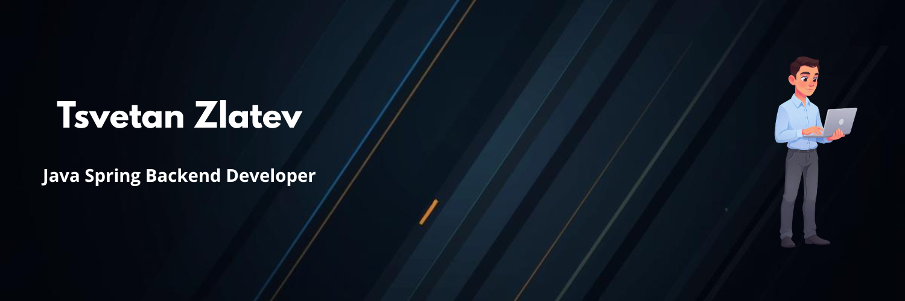

  

 
 

  <h3>I am Tsvetan! 👋 Backend Developer specializing in scalable systems</h3>
  
  

    I build robust backend solutions, focusing on clean architecture, microservices, and efficient APIs using Java and Spring Boot.
  

  
  
  
  
  

 

## 🛠️ Tech Stack & Tools

**Backend & Architecture:**
 

**Frontend & Scripting:**
 

**DevOps & Environment:**
 

---

## 🚀 Featured Projects

### [School Inventory Management System](https://github.com/zlatevv)
A comprehensive microservice-based platform for tracking school equipment and processing borrowing requests.
* **Tech:** Java 17, Spring Boot, Spring Security (JWT), MySQL, RabbitMQ, Docker, Vanilla JS.
* **Highlights:** Implemented role-based access control, an asynchronous notification system using RabbitMQ, and secure RESTful endpoints routed through an API Gateway. 

---

## 📈 GitHub Activity

  
   
  

 

  

